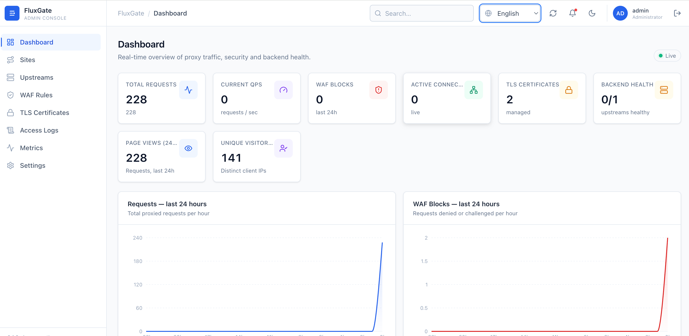

# FluxGate

English · [中文](./README-CN.md)

A **reverse proxy with a built-in WAF and admin panel** — a single Rust binary
that forwards traffic, terminates TLS (with automatic Let's Encrypt / ACME
certificates), enforces a Web Application Firewall, and is managed entirely
through a clean web console (English / 中文 / 日本語).



## Features

- 🔁 **Reverse proxy** — sites & path routes, load balancing, WebSocket & streaming
- 🛡️ **WAF** — OWASP **Core Rule Set (CRS)** built in (SQLi, XSS, RCE, LFI/RFI, scanner detection…), inspecting the **request line, headers _and_ body**; custom IP (IPv4 **+ IPv6**) / path / method / geo / rate-limit / **body** rules; a managed human-verification challenge; and per-IP **brute-force lockout** on the admin login
- 🌍 **Per-site access control** — block by **country** (GeoIP), block **datacenter / cloud IPs** (ASN ≈ "residential only"), or accept **only Cloudflare** traffic. Bound to the site and enforced **even when the WAF is off**; Cloudflare-aware (`CF-Connecting-IP`)
- 🔐 **TLS** — SNI certificate selection + **automatic ACME (Let's Encrypt) issuance & renewal** over HTTP-01
- 📊 **Analytics** — real-time 24h QPS / PV / UV, latency, error rate, visitor-country map, **device / OS breakdown**, and per-site **traffic totals** (lifetime / 30-day / today)
- 🖥️ **Admin console** — embedded in the binary, no separate deploy; tri-lingual UI; branded block / challenge / 404 pages

## Install

```bash
curl https://raw.githubusercontent.com/dollarkillerx/FluxGate/refs/heads/main/install.sh | bash
```

That's it. The installer (run as root; prepend `sudo` if you're not) will:

1. let you **pick a language**, then an admin **account + password**
2. install a **systemd service**, with the proxy on `:80` / `:443` and the
   console on a **random high port**
3. print the **console URL, account and password** when done

Re-run the same command later to get a **stop / restart / update** menu
(`--update` does a zero-downtime upgrade with automatic rollback).

> The console uses a self-signed HTTPS certificate — accept the browser warning
> on first visit. ACME issuance needs your domain to resolve to the host and
> port 80 reachable from the internet.
>
> Each site has **Advanced options** — upload cap (default 500 MB), upstream
> timeout (120 s), crawler blocking, and **IP access control** (block countries,
> block datacenter/cloud IPs, or Cloudflare-only).

## Run from source

```bash
cd web && npm install && npm run build    # build the console (embedded into the binary)
cargo run -p fluxgate-admin                # start FluxGate
```

The **admin console** is then at **`https://127.0.0.1:8080/`** — HTTPS with a
self-signed cert (accept the browser warning); default login **`admin` / `admin`**.
The reverse-proxy data plane defaults to `:80` / `:443`; on a dev machine point it
at high ports so it doesn't need root:

```bash
FLUXGATE_PROXY_ADDR=127.0.0.1:8888 FLUXGATE_PROXY_TLS_ADDR= cargo run -p fluxgate-admin
```

**Frontend hot-reload** (optional): with FluxGate running, start the Vite dev
server in a second terminal — `cd web && npm run dev` — and open
**`http://localhost:5173/`**; it proxies `/rpc` and `/health` to the backend.
GeoIP / ASN databases auto-download on first start (or set `FLUXGATE_GEOIP_DB`
/ `FLUXGATE_ASN_DB`).

## Performance

One Rust binary, no sidecars. Measured on an Apple M5, `--release`.

**WAF rule engine** — per request, single core:

| Pass | Benign (all rules run) | Early match |
| --- | --- | --- |
| request line + headers | ~440 ns | ~210 ns |
| request body (default body rules) | ~280 ns | ~190 ns |

**End-to-end reverse proxy** — ApacheBench, 30k POSTs, concurrency 50, keep-alive,
single box (proxy + upstream local):

| | Throughput | p50 / p99 | Result |
| --- | --- | --- | --- |
| WAF **off** | **~26,900 req/s** | 1 / 7 ms | malicious body passes |
| WAF **on** (full detection + body inspection) | **~21,800 req/s** | 2 / 12 ms | **malicious body → 403** |

Body inspection reads only a bounded **64 KB** prefix, so a malicious
`…union select…from users` payload in a POST body is blocked while larger uploads
still **stream through without buffering** (zero-copy past the scan window). WAF is
per-route — disabled routes pay no WAF cost at all.
